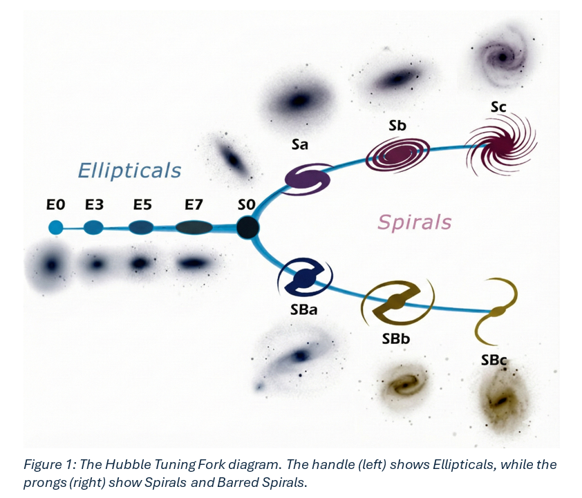
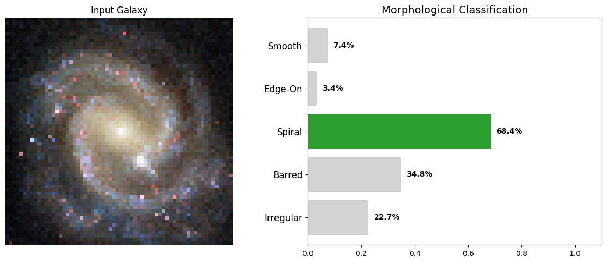

# 🌌 Galaxy Morphology Classification: Addressing Rotational Invariance


## 📑 Executive Summary
[cite_start]This repository contains an automated, end-to-end Machine Vision and Deep Learning pipeline designed to classify the morphological structures of galaxies from the Sloan Digital Sky Survey (SDSS)[cite: 92, 248]. 

[cite_start]The project replicates the probabilistic consensus of human astronomers by categorizing galaxies into five distinct classes: **Smooth, Edge-On, Spiral, Barred, and Irregular**[cite: 176]. [cite_start]By combining a classical OpenCV preprocessing pipeline with a custom, rotation-invariant Convolutional Neural Network (CNN), the system successfully processes noisy astronomical imagery and achieves a Mean Absolute Error (MAE) of 0.1086[cite: 104, 105].

---

## 🚀 The Core Challenges Solved

Standard image recognition models struggle with astronomical data due to two primary factors, which this architecture explicitly addresses:

1. **The Rotational Invariance Problem:** In space, there is no "up" or "down." [cite_start]A spiral galaxy viewed at 45° and 130° represents the exact same object, but a standard CNN interprets these as completely different pixel grids[cite: 157, 160, 162].
2. [cite_start]**Low Signal-to-Noise Ratio (SNR):** Raw astronomical images consist of nearly 80% empty black space, filled with cosmic rays and background noise that confuse feature extraction[cite: 164, 166, 262].

---



## 🧠 System Architecture


The solution is divided into a robust two-stage pipeline:

### Phase 1: Machine Vision Preprocessing (OpenCV)
[cite_start]Instead of feeding raw, noise-heavy images to the neural network, a 5-step classical computer vision pipeline isolates the Region of Interest (ROI)[cite: 264].
* [cite_start]**Gaussian Blurring:** A 5x5 kernel smooths high-frequency "shot noise" while preserving low-frequency galaxy structures[cite: 267, 268].
* [cite_start]**Fixed Binary Thresholding:** Empirically set to a value of 25 to separate the foreground signal from the dark background without discarding faint spiral arms[cite: 269, 270].
* [cite_start]**Morphological Dilation:** A 3x3 kernel (2 iterations) reconnects disjointed pixels of faint spiral arms into a single contiguous contour[cite: 272, 273, 274].
* [cite_start]**Contour Detection & Cropping:** Automatically detects the largest contour, generates a bounding box, and crops the image directly around the galactic core[cite: 275, 276, 277].

### Phase 2: Deep Learning Classification (Custom CNN)
The classification engine is built to dynamically handle the spatial randomness of the cosmos.
* **Spatial Invariance Block:** Utilizes Keras Preprocessing Layers (`RandomRotation` $\pm180^{\circ}$, `RandomFlip`, `RandomZoom`) at the input stage. [cite_start]This forces the network to learn orientation-agnostic features dynamically on the CPU/GPU, eliminating the need for massive static dataset expansion[cite: 318, 319, 320, 321, 725].
* [cite_start]**Hierarchical Feature Extraction:** Four convolutional blocks (32, 64, 128, 256 filters) utilizing `Conv2D`, `Batch Normalization`, `LeakyReLU` ($a=0.1$), and `MaxPooling`[cite: 326, 328, 329, 330, 331].
* **Probabilistic Output:** Utilizes `Global Average Pooling` (to retain spatial data and reduce parameters) feeding into a 5-unit `Sigmoid` output layer. [cite_start]The network is trained using Mean Squared Error (MSE) to predict independent probabilities for each morphological class simultaneously[cite: 332, 333, 334, 359, 360].

---

## 📊 Dataset & Training Strategy

* [cite_start]**Data Fusion:** Fused over 100,000 raw SDSS images from the Galaxy Zoo 2 dataset with "Hart16" debiased volunteer vote fractions[cite: 245, 247, 249, 256].
* [cite_start]**Artifact Filtering:** Rigorous cleaning discarded any image with a $>50\%$ probability of being a foreground star/artifact, ensuring the model trained on pure galactic features[cite: 258, 259, 260].
* [cite_start]**Optimization:** Trained over 35 epochs using the Adam optimizer (initial learning rate $\eta=0.001$), backed by `ReduceLROnPlateau` and `EarlyStopping` callbacks to prevent overfitting[cite: 361, 364, 368, 372]. [cite_start]A 40% Dropout layer further ensured strong generalization[cite: 374, 375].

---

## 📈 Key Results & Evaluation

The model achieved highly competitive results, proving its viability for pre-filtering large-scale astronomical data streams. 

| Metric | Score | Note |
| :--- | :--- | :--- |
| **Validation MAE** | `0.1086` | [cite_start]Predictions deviate by <10.8% from human consensus[cite: 382, 384]. |
| **Overall Accuracy** | `82%` | [cite_start]Across five highly subjective morphological classes[cite: 382]. |
| **Spiral $R^2$ Score** | `0.708` | [cite_start]Strong linear correlation in detecting complex spiral patterns[cite: 453]. |

### ROC Analysis & AUC Scores
[cite_start]The model demonstrated exceptional sensitivity and specificity across all classes[cite: 484]:
* [cite_start]**Smooth:** 0.98 AUC [cite: 477]
* [cite_start]**Edge-On:** 0.97 AUC [cite: 477]
* [cite_start]**Irregular:** 0.95 AUC [cite: 477]
* [cite_start]**Spiral:** 0.92 AUC [cite: 477]
* [cite_start]**Barred:** 0.90 AUC [cite: 477]


### Interpretability
[cite_start]Internal feature map visualizations from `conv2d_4` confirm that the network organically learned to identify galactic cores (bulges) as central blobs, while deeper filters activated on the high-frequency textural changes of spiral arms[cite: 679, 680, 701, 702, 703].



---

## 💻 Technologies Used
* [cite_start]**Languages:** Python 3.10 [cite: 338]
* [cite_start]**Deep Learning:** TensorFlow / Keras (v2.x) [cite: 340]
* [cite_start]**Computer Vision:** OpenCV (`cv2`) [cite: 342]
* [cite_start]**Data Handling & Analysis:** Pandas, NumPy, Scikit-Learn [cite: 344, 345, 349]
* [cite_start]**Visualization:** Matplotlib, Seaborn [cite: 346]

---

## ⚙️ Installation & Usage

1. Clone this repository:
   ```bash
   git clone [https://github.com/yourusername/galaxy-morphology-classification.git](https://github.com/yourusername/galaxy-morphology-classification.git)
