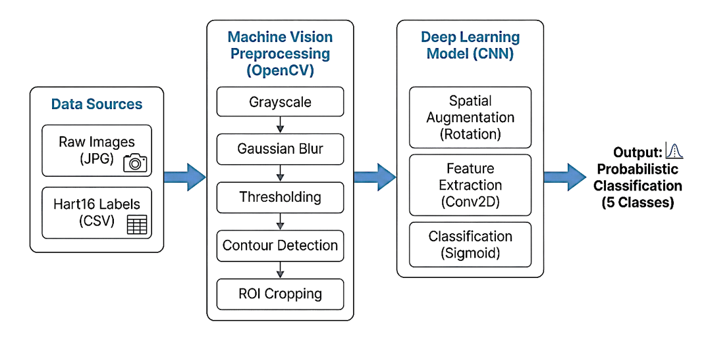
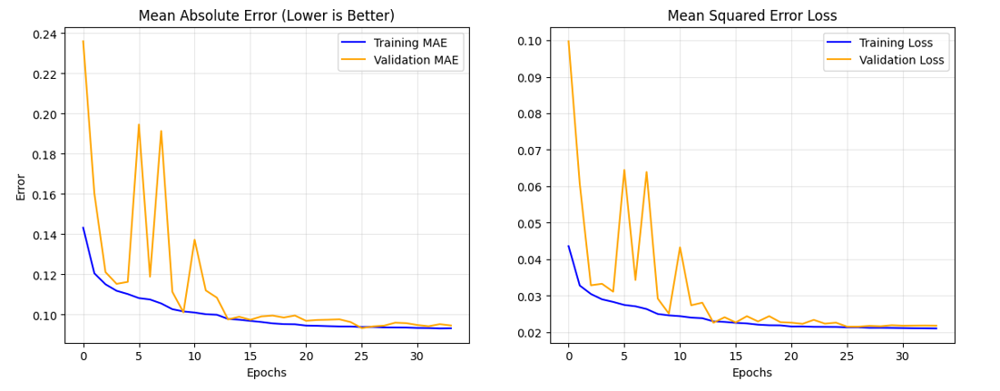

# Automated End-to-End Machine Vision System for Galaxy Morphology Classification


## 🌌 Overview
[cite_start]As modern astronomy enters the era of "Big Data" with surveys like the Sloan Digital Sky Survey (SDSS) capturing millions of celestial images, manual morphological classification has become an impossible bottleneck[cite: 92, 93]. 

[cite_start]This project presents an automated, end-to-end Machine Vision and Deep Learning pipeline designed to replicate the consensus of human experts and citizen scientists[cite: 97, 172]. [cite_start]By fusing classical OpenCV preprocessing with a custom, rotation-invariant Convolutional Neural Network (CNN), this system categorizes galaxies into five distinct morphological classes (Smooth, Edge-On, Spiral, Barred, and Irregular)[cite: 104, 118].

## 🚀 Key Engineering Challenges Solved

### 1. The Rotational Invariance Problem
[cite_start]In Earth-based photography, there is a fixed orientation, but in space, there is no "up" or "down"[cite: 157, 158]. [cite_start]Standard CNNs struggle with this, often recognizing a spiral galaxy rotated at 90 degrees as an entirely different object[cite: 161, 162]. 
* [cite_start]**Solution:** Instead of massively inflating the dataset size on disk, this architecture seamlessly embeds dynamic Keras preprocessing layers (`RandomRotation(0.5)`, `RandomFlip`, `RandomZoom(0.1)`) directly into the model pipeline[cite: 102, 319, 320, 321]. [cite_start]This artificial augmentation on the GPU/CPU forces the network to learn spatially invariant features[cite: 321, 725].

### 2. Low Signal-to-Noise Ratio (SNR)
[cite_start]Raw astronomical images are often faint, fuzzy, and composed of 80% blank space, heavily polluted by cosmic rays and foreground stars[cite: 164, 165, 262].
* [cite_start]**Solution:** Developed a 5-step classical Machine Vision pipeline using OpenCV to autonomously deblend and isolate the Region of Interest (ROI)[cite: 100, 264]. 

---

## 🛠️ System Architecture



### Phase 1: Machine Vision Preprocessing (OpenCV)
[cite_start]To ensure the CNN receives high-signal input rather than noise-dominated empty space, all images pass through an automated cropping sequence[cite: 224, 225]:
1. [cite_start]**Grayscale Conversion:** Reduces dimensionality[cite: 266].
2. [cite_start]**Gaussian Blurring:** A $5\times5$ kernel smooths high-frequency shot noise while preserving galactic structures[cite: 267, 268].
3. [cite_start]**Fixed Binary Thresholding:** Empirically set to 25 to retain the faintest outer spiral arms[cite: 269, 270].
4. [cite_start]**Morphological Dilation:** A $3\times3$ kernel reconnects disjointed binary pixels into a contiguous contour[cite: 272, 274].
5. [cite_start]**Contour Detection & ROI Cropping:** Automatically calculates a bounding box around the largest continuous structure and crops the image to the galactic core[cite: 275, 277].

### Phase 2: Deep Learning Architecture
[cite_start]A custom CNN was engineered to handle multi-label probabilistic regression[cite: 314, 358].
* [cite_start]**Feature Extraction:** 4 Conv2D blocks (32, 64, 128, 256 filters) utilizing Batch Normalization and LeakyReLU ($\alpha=0.1$) to prevent dead gradients[cite: 326, 329, 330].
* [cite_start]**Parameter Reduction:** Implemented Global Average Pooling instead of Flattening to preserve spatial data and reduce computational load[cite: 103, 332].
* [cite_start]**Classification Head:** A Dense layer with 5 units and a Sigmoid activation function outputs independent probabilities for each morphological category[cite: 334, 360].

---

## 📊 Dataset & Training

* [cite_start]**Data Sources:** Raw SDSS images mapped to "Hart16" debiased vote fractions from the Galaxy Zoo 2 project[cite: 247, 249].
* [cite_start]**Scale:** A stratified random sample of 100,000 images, aggressively filtered to remove star artifacts[cite: 256, 258].
* [cite_start]**Loss Function:** Mean Squared Error (MSE) was utilized to predict the continuous probability distribution (e.g., "80% Spiral, 20% Barred") rather than enforcing a false binary classification[cite: 356, 359].
* [cite_start]**Regularization:** Deployed a `ReduceLROnPlateau` scheduler and a 40% Dropout rate to ensure generalization and prevent overfitting[cite: 368, 374].

---

## 📈 Performance & Results

[cite_start]The final model achieved exceptional fidelity when compared against human consensus[cite: 709, 710]:

* [cite_start]**Mean Absolute Error (MAE):** 0.1086 (Validation) - meaning the AI's probability estimates deviate from expert consensus by less than 10.8% on average[cite: 382, 384].
* [cite_start]**Overall Classification Accuracy:** 82%[cite: 382].

| Morphological Class | ROC AUC Score |
| :--- | :--- |
| **Smooth** | 0.98 |
| **Edge-On** | 0.97 |
| **Spiral** | 0.92 |
| **Barred** | 0.90 |
| **Irregular** | 0.95 |




### Interpretability
[cite_start]Feature map visualization (Layer `conv2d_4`) confirms the network mimics biological vision hierarchically—successfully identifying galactic cores (bulges) as central blobs, and recognizing textured high-frequency spatial changes corresponding to spiral arms[cite: 679, 701, 703, 705].

---

## 💻 Tech Stack
* [cite_start]**Languages:** Python 3.10 [cite: 338]
* [cite_start]**Deep Learning:** TensorFlow / Keras (v2.x) [cite: 340]
* [cite_start]**Computer Vision:** OpenCV (cv2) [cite: 342]
* [cite_start]**Data Processing:** Pandas, NumPy, Scikit-Learn [cite: 344, 345, 349]
* [cite_start]**Visualization:** Matplotlib, Seaborn [cite: 346]

---

## 📂 Repository Structure

```text
galaxy-morphology-classification/
├── data/                  # Instructions for downloading GZ2/Hart16 datasets
├── notebooks/             # EDA, preprocessing pipelines, and model training
├── src/                   # Modularized Python scripts for OpenCV processing
├── models/                # Saved weights (.h5) of the final trained CNN
├── images/                # Output graphs, ROC curves, and feature maps
├── requirements.txt       # Environment dependencies
└── README.md
